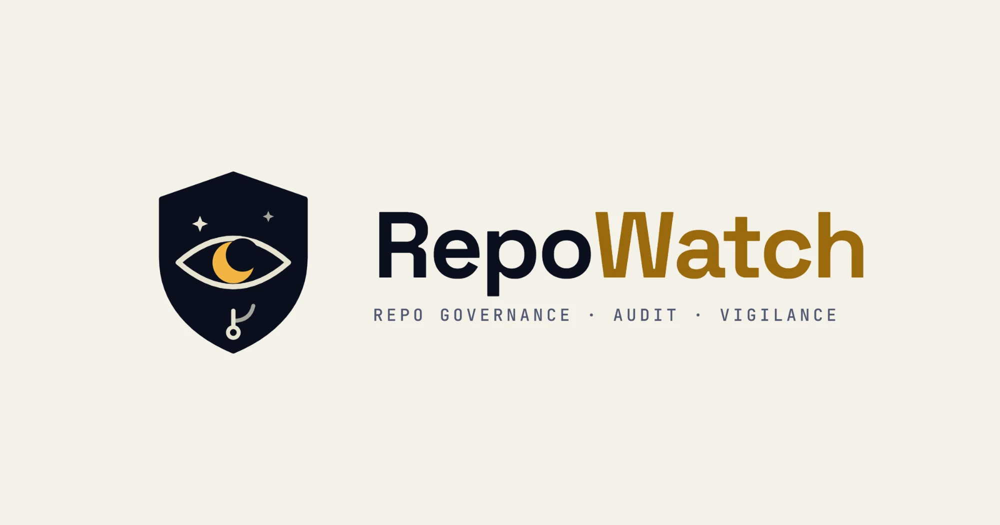

# RepoWatch GitHub App



A GitHub App that runs [RepoWatch](https://github.com/axxess-triaxis/RepoWatch) governance audits on the repositories you grant it, and keeps the results in one **"RepoWatch audit"** issue.

RepoWatch looks for the failure modes AI-assisted teams actually hit:

- open Dependabot alerts, kept separate from "Dependabot turned off" and "no access"
- PRs open more than 10 days
- merges that still carry conflict markers
- recent commits with no test run behind them
- possible PII in the code, always shown masked
- near-duplicate repositories

## How it works

- **When it runs:** when you install it, when you grant it more repositories, every Monday at 03:30 UTC, and whenever someone with write access comments `/repowatch run` on the report issue.
- **What it audits:** only the repositories you grant it, and not archived repositories or forks.
- **Where the report goes:** your org's `.github` repository if the App can reach it, or the single repository you granted if you granted only one. If you grant several repositories and not `.github`, the App has nowhere unambiguous to post, so it posts nothing. Grant it `.github` to receive the report.

## Permissions

| Permission | Access | Why |
|---|---|---|
| Metadata | Read | List the repositories granted to the App (required by GitHub) |
| Contents | Read | Recent commits, and the file tree and files for the PII scan |
| Pull requests | Read | Find stale PRs |
| Checks | Read | See whether commits had a test run |
| Dependabot alerts | Read | Count open vulnerability alerts |
| Issues | Read and write | Create and update the single report issue, and reply to `/repowatch run` |

The App never writes code, never changes settings and never comments on pull requests. Its only write is the report issue and its replies.

## Data handling

See [docs/privacy.md](docs/privacy.md). In short:

- Code is read in memory during an audit and never stored.
- The only output is the report issue in your own repository, with PII masked.
- Operational logs (installation ID, repository counts, errors) are kept for 30 days in AWS CloudWatch (ap-south-1).
- There's no third-party analytics.

## Architecture

```
GitHub webhook -> API Gateway (HTTP API) -> webhook Lambda --> SQS jobs queue -> worker Lambda
EventBridge Scheduler (weekly) --------------------------------^                    |
                                                                  RepoWatch audit + report issue
```

- The webhook Lambda verifies `X-Hub-Signature-256` and returns quickly. Audits run in the worker, with a 15-minute limit.
- Failed jobs are retried twice, then go to a dead-letter queue. CloudWatch alarms fire on worker errors, dead letters and webhook errors.
- There are two Secrets Manager secrets. The webhook secret is generated at deploy time and readable only by the webhook function. The App private key is set by the operator and readable only by the worker.
- Infrastructure is AWS CDK (Python) in `infra/`. Deployment steps are in [docs/SETUP.md](docs/SETUP.md).

## Development

```bash
python -m venv .venv && .venv/Scripts/activate        # Windows; use .venv/bin/activate elsewhere
pip install -r requirements-dev.txt
pytest
python scripts/build_lambda.py
npx aws-cdk@2.1142.0 synth -c client_id=<GitHub App client ID>
```

## License

MIT, see [LICENSE](LICENSE). Built by Triaxis Ventures.
